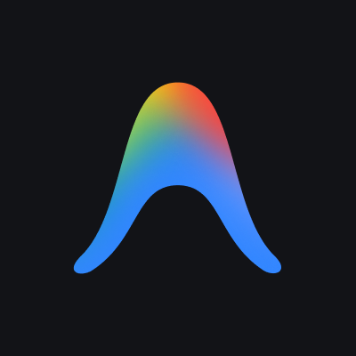

  

---

<h2 align="center">Profile</h2>

Software engineer working across the <b>entire stack</b>: responsive web interfaces, cross-platform mobile apps, 
and the APIs, databases, and infrastructure behind them. Alongside development, I work as a 
<b>cybersecurity engineer</b>, building security into systems from the first design decision rather than bolting it on later.

---

<h2 align="center">Technology Stack</h2>

<h4 align="center">Languages</h4>

<h4 align="center">Frontend</h4>

<h4 align="center">Mobile</h4>

<h4 align="center">Backend</h4>

<h4 align="center">Databases and Cloud Data</h4>

<h4 align="center">Security and Infrastructure</h4>

<h4 align="center">Developer Tooling</h4>

---

<h2 align="center">Areas of Expertise</h2>

<table align="center">
<tr>
<td align="center" width="200" valign="top">

<b>Frontend</b>
  
Component architecture 
Server-side rendering 
Responsive interfaces 
Performance tuning

</td>
<td align="center" width="200" valign="top">

<b>Backend</b>
  
REST API design 
Authentication and authorization 
Database modeling 
Service architecture

</td>
<td align="center" width="200" valign="top">

<b>Mobile</b>
  
React Native and Expo 
Flutter 
Cross-platform delivery 
API-driven apps

</td>
<td align="center" width="200" valign="top">

<b>Cybersecurity</b>
  
Application security 
Network security 
System hardening 
Secure code practices

</td>
<td align="center" width="200" valign="top">

<b>Automation</b>
  
AI agents 
API integrations 
Workflow automation 
Developer tooling

</td>
</tr>
</table>

---

<h2 align="center">Activity Dashboard</h2>

---

<h2 align="center">Open to Collaboration</h2>

Full-stack products, mobile applications, secure backend systems, and security engineering work.

